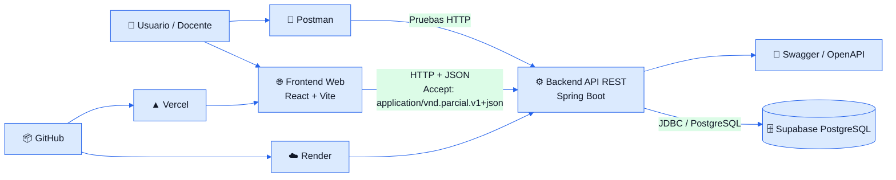
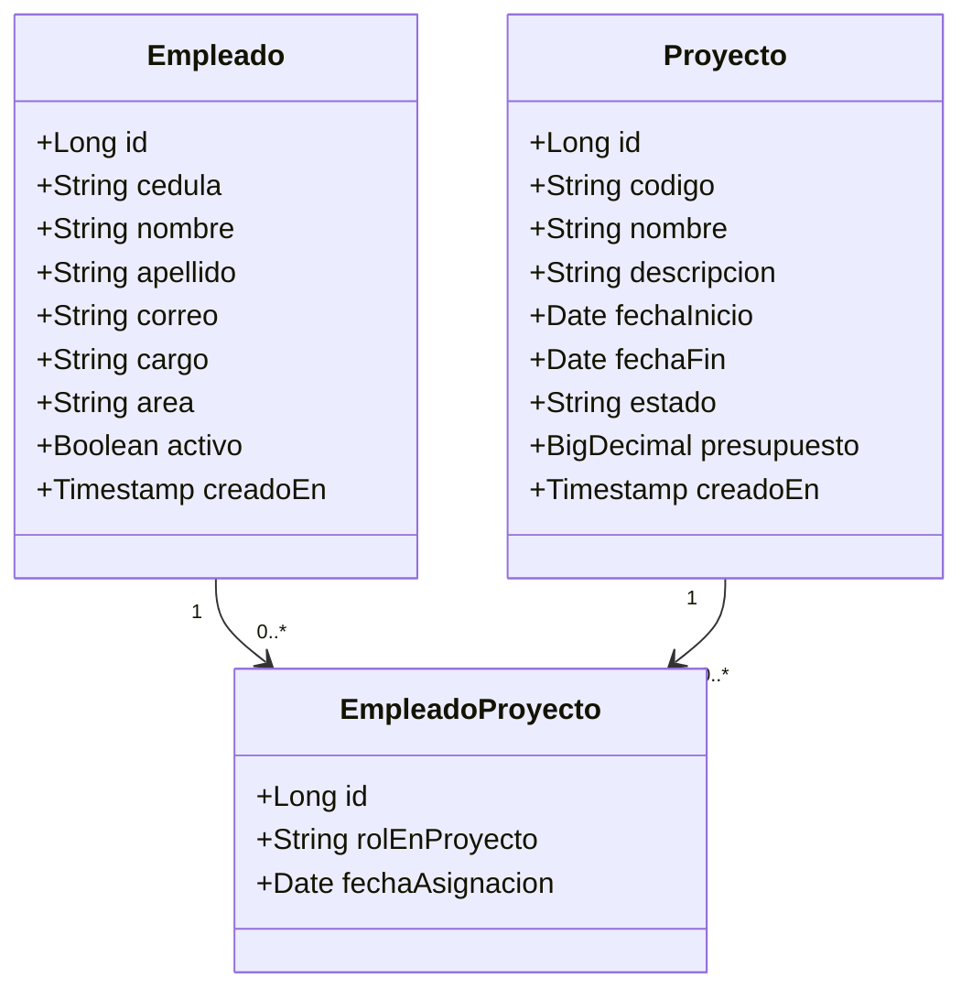
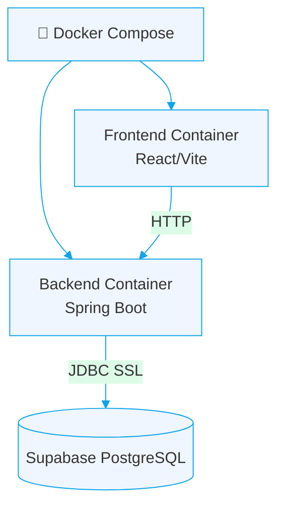
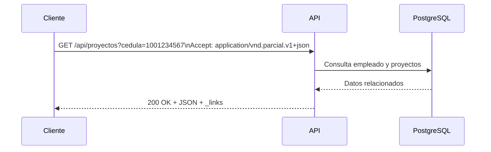
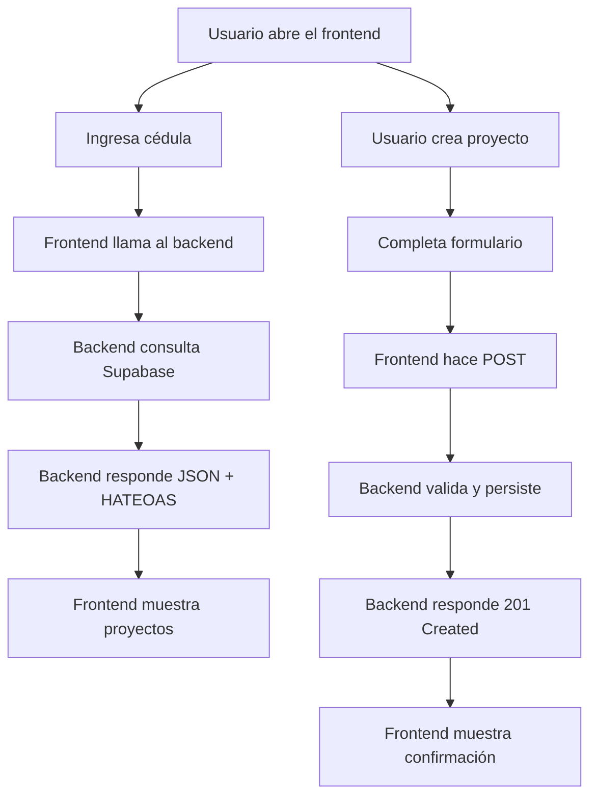
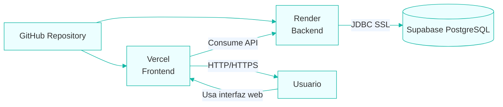

<p align="center">
  
</p>

<p align="center">
  <a href="https://github.com/spalacioc05/parcial-2-arquisoft-ssjj">
    
  </a>
  <a href="https://parcial-2-arquisoft-ssjj.onrender.com/swagger-ui/index.html">
    
  </a>
  <a href="https://parcial-2-arquisoft-ssjj.onrender.com/api/health">
    
  </a>
  <a href="https://parcial-2-arquisoft-ssjj.onrender.com">
    
  </a>
  <a href="https://TU-URL-DE-VERCEL.vercel.app">
    
  </a>
</p>

<p align="center">
  
  
  
  
  
</p>

---

# 📘 Parcial 2 - Arquitectura de Software  
## Sistema de Gestión de Proyectos y Empleados

Solución **fullstack** desarrollada para el **Parcial Práctico de Arquitectura de Software**, orientada a la gestión de proyectos empresariales y empleados asignados.  

El sistema permite:

- Consultar los **proyectos asignados a un empleado** mediante su **cédula**.
- Registrar **nuevos proyectos** junto con sus **empleados asignados**.
- Exponer una **API RESTful** con:
  - respuestas JSON,
  - **HATEOAS**,
  - **versionamiento por Accept Header**,
  - **Swagger/OpenAPI**,
  - **Docker**,
  - y persistencia en **PostgreSQL sobre Supabase**.

---

# 👥 Integrantes

| Integrante | Rol general |
|---|---|
| Santiago Palacio Cárdenas | Desarrollo e integración |
| Sarai Restrepo Rodríguez | Pruebas y validación |
| Juan Pablo Herrera Jaramillo | Arquitectura y documentación |
| Jimena Muñoz Gómez | Frontend y apoyo visual |

> **Docente:** *[Agregar nombre del profesor si lo deseas]*  
> **Grupo:** 7  
> **Universidad:** Universidad de Antioquia  
> **Asignatura:** Arquitectura de Software  

---

# 🎯 Objetivo del proyecto

Construir una solución de software que cumpla con los requerimientos del parcial, implementando una arquitectura limpia, mantenible y desplegable, capaz de:

1. Exponer un **servicio RESTful**.
2. Permitir consultar proyectos por **cédula del empleado**.
3. Permitir registrar **proyectos con empleados**.
4. Aplicar **HATEOAS**.
5. Manejar **versionamiento por Accept Header**.
6. Utilizar **Docker**.
7. Documentar y desplegar la solución.

---

# ✅ Requisitos del parcial cubiertos

- [x] Servicio Web **RESTful**
- [x] Método **GET** para consultar proyectos por cédula
- [x] Método **POST** para crear proyectos con empleados
- [x] Respuestas en **JSON**
- [x] **Versionamiento por Accept Header**
- [x] **HATEOAS**
- [x] **Códigos HTTP** correctos
- [x] **Swagger / OpenAPI**
- [x] Uso obligatorio de **Docker**
- [x] Uso de **PostgreSQL** en **Supabase**
- [x] Repositorio en **GitHub**
- [x] Evidencias y documentación
- [x] Frontend como valor agregado
- [x] Despliegue del backend en **Render**
- [x] Despliegue del frontend en **Vercel**

---

# 🧰 Stack tecnológico

## Backend
<p>
  
  
  
  
  
  
  
</p>

## Frontend
<p>
  
  
  
  
  
</p>

## Datos y despliegue
<p>
  
  
  
  
  
</p>

---

# 🏗️ Arquitectura general

La solución sigue una arquitectura cliente-servidor con separación clara entre frontend, backend y persistencia.



---

# 🧩 Modelo de dominio

El sistema maneja tres estructuras principales:

- **Empleado**
- **Proyecto**
- **EmpleadoProyecto** (tabla intermedia para relación y asignación)



---

# 🗂️ Estructura del proyecto

```text
parcial-2-arquisoft-ssjj/
├── front-end/
│   ├── public/
│   ├── src/
│   ├── .env.example
│   ├── index.html
│   ├── vercel.json
│   ├── vite.config.ts
│   └── README.md
├── backend/
│   ├── src/
│   │   ├── main/java/com/parcial/arquisoft/
│   │   │   ├── config/
│   │   │   ├── controller/
│   │   │   ├── dto/
│   │   │   ├── entity/
│   │   │   ├── exception/
│   │   │   ├── repository/
│   │   │   └── service/
│   │   └── resources/
│   ├── Dockerfile
│   └── pom.xml
├── db/
│   ├── schema.sql
│   └── seed.sql
├── docs/
│   ├── arquitectura.md
│   └── evidencias.md
├── postman/
│   └── parcial-2-arquisoft.postman_collection.json
├── docker-compose.yml
├── .env.example
├── vercel.json
└── README.md
```

---

# 🗃️ Base de datos

La base de datos se implementó en **Supabase PostgreSQL**.

## Tablas principales

- `empleados`
- `proyectos`
- `empleado_proyecto`

## Ejecución de scripts

1. Abrir el editor SQL de Supabase.
2. Ejecutar:

```sql
-- Crear esquema
db/schema.sql

-- Cargar datos semilla
db/seed.sql
```

---

# 🔐 Variables de entorno

## Variables de entorno generales (`.env.example`)

```env
SERVER_PORT=8080

SPRING_DATASOURCE_URL=jdbc:postgresql://aws-1-us-west-2.pooler.supabase.com:5432/postgres?sslmode=require&prepareThreshold=0
SPRING_DATASOURCE_USERNAME=postgres.nwghyyacoflihtacamip
SPRING_DATASOURCE_PASSWORD=parcial-2-arquisoft-ssjj

SPRING_DATASOURCE_HIKARI_MAXIMUM_POOL_SIZE=2
SPRING_DATASOURCE_HIKARI_MINIMUM_IDLE=0
SPRING_DATASOURCE_HIKARI_IDLE_TIMEOUT=10000
SPRING_DATASOURCE_HIKARI_MAX_LIFETIME=30000
SPRING_DATASOURCE_HIKARI_CONNECTION_TIMEOUT=30000
SPRING_DATASOURCE_HIKARI_VALIDATION_TIMEOUT=5000

FRONTEND_URL=https://parcial-2-arquisoft-ssjj.vercel.app/

VITE_API_URL=http://localhost:8080
VITE_API_ACCEPT=application/vnd.parcial.v1+json
```

## Variables para Render (backend en producción)

```env
SPRING_DATASOURCE_URL=jdbc:postgresql://aws-1-us-west-2.pooler.supabase.com:5432/postgres?sslmode=require&prepareThreshold=0
SPRING_DATASOURCE_USERNAME=postgres.nwghyyacoflihtacamip
SPRING_DATASOURCE_PASSWORD=parcial-2-arquisoft-ssjj
SPRING_DATASOURCE_HIKARI_MAXIMUM_POOL_SIZE=2
SPRING_DATASOURCE_HIKARI_MINIMUM_IDLE=0
SPRING_DATASOURCE_HIKARI_IDLE_TIMEOUT=10000
SPRING_DATASOURCE_HIKARI_MAX_LIFETIME=30000
SPRING_DATASOURCE_HIKARI_CONNECTION_TIMEOUT=30000
SPRING_DATASOURCE_HIKARI_VALIDATION_TIMEOUT=5000
FRONTEND_URL=https://TU-URL-DE-VERCEL.vercel.app
```

## Variables para Vercel (frontend en producción)

```env
VITE_API_URL=https://parcial-2-arquisoft-ssjj.onrender.com
VITE_API_ACCEPT=application/vnd.parcial.v1+json
```

---

# ▶️ Ejecución local

## 1. Clonar el repositorio

```bash
git clone https://github.com/spalacioc05/parcial-2-arquisoft-ssjj.git
cd parcial-2-arquisoft-ssjj
```

## 2. Backend local

```bash
cd backend
mvn clean package
mvn spring-boot:run
```

El backend quedará en:

- `http://localhost:8080`
- `http://localhost:8080/api/health`
- `http://localhost:8080/swagger-ui/index.html`

## 3. Frontend local

```bash
cd front-end
npm install
npm run dev
```

El frontend quedará en:

- `http://localhost:3000`

---

# 🐳 Ejecución con Docker

La solución se dockerizó para cumplir con el requerimiento del parcial.

## Levantar contenedores

```bash
docker compose up --build
```

## Detener contenedores

```bash
docker compose down
```

## Puertos esperados

- **Frontend:** `http://localhost:3000`
- **Backend:** `http://localhost:8080`
- **Swagger:** `http://localhost:8080/swagger-ui/index.html`



---

# ☁️ Despliegue

## Backend en Render

URL backend:

```text
https://parcial-2-arquisoft-ssjj.onrender.com
```

### Configuración importante

- Root Directory: `backend`
- Environment: `Docker`
- Variables de entorno configuradas manualmente
- Puerto leído con:

```properties
server.port=${PORT:${SERVER_PORT:8080}}
```

### Solución al problema de conexiones de Supabase

Se limitó el pool de HikariCP a **2 conexiones** para evitar:

- `EMAXCONNSESSION`
- saturación del pool de Supabase
- fallos de metadata JDBC al iniciar

---

## Frontend en Vercel

URL frontend:

```text
https://TU-URL-DE-VERCEL.vercel.app
```

### Configuración recomendada

- Framework Preset: `Vite`
- Root Directory: `front-end`
- Build Command: `npm run build`
- Output Directory: `dist`
- Install Command: `npm install`

### Archivos clave

- `front-end/vercel.json`
- `front-end/index.html`
- `front-end/public/_redirects`

---

# 🔌 Endpoints principales

## Health Check

```http
GET /api/health
```

## Consultar proyectos por cédula

```http
GET /api/proyectos?cedula=1001234567
Accept: application/vnd.parcial.v1+json
```

## Consultar proyecto por id

```http
GET /api/proyectos/1
Accept: application/vnd.parcial.v1+json
```

## Crear proyecto con empleados

```http
POST /api/proyectos
Accept: application/vnd.parcial.v1+json
Content-Type: application/json
```

### Ejemplo de body

```json
{
  "codigo": "PRY-004",
  "nombre": "Sistema de Gestion Documental",
  "descripcion": "Sistema para administrar documentos internos de la empresa.",
  "fechaInicio": "2026-06-15",
  "fechaFin": "2026-09-30",
  "estado": "ACTIVO",
  "presupuesto": 12000000,
  "empleados": [
    {
      "cedula": "1001234567",
      "nombre": "Santiago",
      "apellido": "Palacio",
      "correo": "santiago.palacio@empresa.com",
      "cargo": "Desarrollador Backend",
      "area": "Tecnologia",
      "rolEnProyecto": "Desarrollador Principal",
      "fechaAsignacion": "2026-06-15"
    }
  ]
}
```

---

# 🧭 HATEOAS

La API devuelve enlaces relacionados en el atributo `_links`, permitiendo descubrir acciones y recursos relacionados.

## Ejemplo conceptual

```json
{
  "empleado": {
    "cedula": "1001234567",
    "nombreCompleto": "Santiago Palacio",
    "correo": "santiago.palacio@empresa.com",
    "cargo": "Desarrollador Backend",
    "area": "Tecnologia"
  },
  "cantidadProyectos": 2,
  "proyectos": [
    {
      "id": 1,
      "codigo": "PRY-001",
      "nombre": "Sistema de Gestion de Inventario",
      "_links": {
        "self": {
          "href": "http://localhost:8080/api/proyectos/1"
        }
      }
    }
  ],
  "_links": {
    "self": {
      "href": "http://localhost:8080/api/proyectos?cedula=1001234567"
    },
    "crear-proyecto": {
      "href": "http://localhost:8080/api/proyectos"
    },
    "swagger": {
      "href": "http://localhost:8080/swagger-ui/index.html"
    }
  }
}
```

---

# 🏷️ Versionamiento por Accept Header

La API no usa la versión en la URL.  
En su lugar, utiliza:

```http
Accept: application/vnd.parcial.v1+json
```

Esto garantiza desacoplamiento entre versión y ruta.



---

# 📚 Swagger / OpenAPI

Swagger está disponible en:

- **Local:** `http://localhost:8080/swagger-ui/index.html`
- **Producción:** `https://parcial-2-arquisoft-ssjj.onrender.com/swagger-ui/index.html`

OpenAPI JSON:

- `http://localhost:8080/v3/api-docs`
- `https://parcial-2-arquisoft-ssjj.onrender.com/v3/api-docs`

---

# 🧪 Pruebas

## Pruebas manuales

Se realizaron pruebas sobre:

- `GET /api/health`
- `GET /api/proyectos?cedula=1001234567`
- `GET /api/proyectos` sin cédula → `400`
- `GET /api/proyectos?cedula=999999999` → `404`
- `POST /api/proyectos` → `201`
- `POST` duplicado → `409`

## Pruebas con Postman

La colección se encuentra en:

```text
postman/parcial-2-arquisoft.postman_collection.json
```

## Pruebas automatizadas

En backend se incluyeron pruebas con:

- **JUnit 5**
- **MockMvc**

Comandos:

```bash
cd backend
mvn test
```

> En algunos entornos, `mvn test` puede presentar problemas de certificados (`PKIX path building failed`) por configuración local de Maven/Git, no por fallos del código fuente.

---

# 📷 Evidencias

Las evidencias completas del proyecto se documentan en:

```text
docs/evidencias.md
```

Allí se incluyen capturas de:

- Supabase
- Swagger
- Docker
- Frontend local
- Backend local
- Postman
- GitHub
- Render
- Vercel

---

# 🧠 Decisiones arquitectónicas relevantes

## ¿Por qué Spring Boot?

Porque permite construir rápidamente una API REST robusta con:

- controladores,
- servicios,
- repositorios,
- validaciones,
- HATEOAS,
- Swagger,
- y manejo centralizado de excepciones.

## ¿Por qué tabla intermedia `empleado_proyecto`?

Porque la relación entre empleados y proyectos es **muchos a muchos**, y además se necesita guardar datos de la asignación:

- `rol_en_proyecto`
- `fecha_asignacion`

## ¿Por qué versionamiento por Accept Header?

Porque era un requerimiento explícito del parcial y desacopla la versión de la URI.

## ¿Por qué Docker?

Porque era obligatorio y facilita la portabilidad, estandarización de ejecución y demostración reproducible.

## ¿Por qué Supabase?

Porque brinda PostgreSQL administrado, rápido de usar, ideal para un escenario académico con despliegue remoto.

---

# 📌 Flujo de uso del sistema



---

# 🔭 Diagrama de despliegue resumido



---

# 🧾 Códigos HTTP usados

| Código | Significado |
|---|---|
| `200 OK` | Consulta exitosa |
| `201 Created` | Recurso creado correctamente |
| `400 Bad Request` | Parámetros faltantes o inválidos |
| `404 Not Found` | Empleado o proyecto no encontrado |
| `409 Conflict` | Conflicto por duplicidad |
| `500 Internal Server Error` | Error inesperado |

---

# 📁 Archivos importantes del proyecto

| Archivo | Propósito |
|---|---|
| `README.md` | Documentación principal |
| `db/schema.sql` | Creación de tablas |
| `db/seed.sql` | Datos semilla |
| `docker-compose.yml` | Orquestación local |
| `front-end/vercel.json` | Configuración de Vercel |
| `backend/Dockerfile` | Imagen del backend |
| `docs/arquitectura.md` | Diagramas y arquitectura |
| `docs/evidencias.md` | Evidencias del proyecto |
| `postman/parcial-2-arquisoft.postman_collection.json` | Colección de pruebas |

---

# 🚀 Estado del proyecto

| Módulo | Estado |
|---|---|
| Backend REST | ✅ Completo |
| Frontend | ✅ Completo |
| Supabase | ✅ Configurado |
| Docker | ✅ Configurado |
| Swagger | ✅ Funcional |
| Postman | ✅ Funcional |
| Render | ✅ Desplegado |
| Vercel | ✅ Preparado / desplegado |
| Documentación | ✅ Completa |

---

# 🔗 Enlaces importantes

## Repositorio
- **GitHub:** https://github.com/spalacioc05/parcial-2-arquisoft-ssjj

## Backend
- **Render:** https://parcial-2-arquisoft-ssjj.onrender.com
- **Health:** https://parcial-2-arquisoft-ssjj.onrender.com/api/health
- **Swagger:** https://parcial-2-arquisoft-ssjj.onrender.com/swagger-ui/index.html

## Frontend
- **Vercel:** https://parcial-2-arquisoft-ssjj.vercel.app/

---

# 📬 Entrega

El proyecto entregado incluye:

- código fuente completo,
- frontend,
- backend,
- scripts SQL,
- Docker,
- colección Postman,
- documentación,
- evidencias,
- y despliegue.

---

# 📄 Licencia / uso académico

Este proyecto fue desarrollado con fines **académicos** como solución al **Parcial 2 de Arquitectura de Software**.  
Su objetivo principal es demostrar el diseño, implementación, prueba, documentación y despliegue de una solución basada en servicios RESTful.

---

<p align="center">
  
</p>
