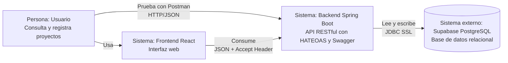
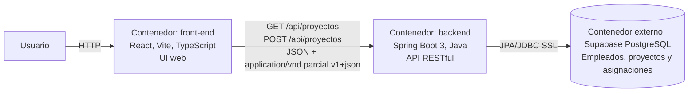
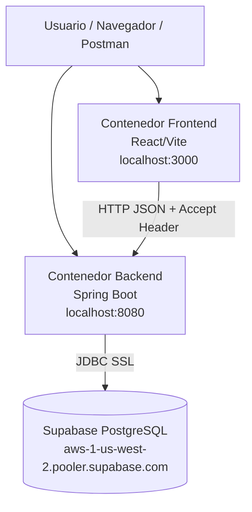

# Arquitectura de la solucion

## Descripcion general

La solucion implementa una arquitectura por capas. El frontend React/Vite consume la API REST del backend Spring Boot. El backend valida solicitudes, aplica reglas de negocio, genera respuestas DTO con HATEOAS y persiste la informacion en PostgreSQL alojado en Supabase.

## Diagrama C4 de contexto

## Diagrama C4 de contenedores

## Diagrama de despliegue

## Decisiones arquitectonicas

- Se usa arquitectura por capas para separar responsabilidades entre API, reglas de negocio, persistencia y representacion.
- Se usan DTOs para no exponer entidades JPA directamente.
- Se usa `EmpleadoProyecto` como entidad intermedia porque la asignacion tiene datos propios: rol y fecha.
- Se usa Supabase PostgreSQL para cumplir el requisito de base de datos relacional externa.
- Se usa Swagger/OpenAPI para facilitar prueba y documentacion del contrato.
- Se usa Docker Compose para levantar backend y frontend con un solo comando.

## Atributos de calidad

- Modificabilidad: paquetes separados por responsabilidad.
- Interoperabilidad: API REST JSON consumible por navegador, Postman u otros clientes.
- Testabilidad: pruebas MockMvc sin depender de Supabase.
- Seguridad basica: credenciales leidas desde variables de entorno.
- Mantenibilidad: DTOs, servicios y repositorios separados.
- Disponibilidad basica: endpoint `GET /api/health`.

## Arquitectura por capas

Los controladores reciben HTTP y construyen respuestas HATEOAS. Los servicios concentran reglas de negocio como validaciones, reutilizacion de empleados y creacion de asignaciones. Los repositorios encapsulan acceso a datos. Las entidades representan tablas y relaciones.

## Entidad intermedia EmpleadoProyecto

No se usa `@ManyToMany` directo porque la relacion entre empleados y proyectos contiene atributos propios. `EmpleadoProyecto` permite guardar `rol_en_proyecto` y `fecha_asignacion`, ademas de imponer unicidad entre empleado y proyecto.

## Versionamiento por Accept Header

La API principal produce `application/vnd.parcial.v1+json`. Esto permite evolucionar versiones sin cambiar rutas como `/api/v1`, manteniendo URLs estables.

## HATEOAS

Las respuestas incluyen `_links` para que el cliente pueda descubrir recursos relacionados: enlace a si mismo, creacion de proyecto, Swagger y proyectos del empleado cuando aplica.
